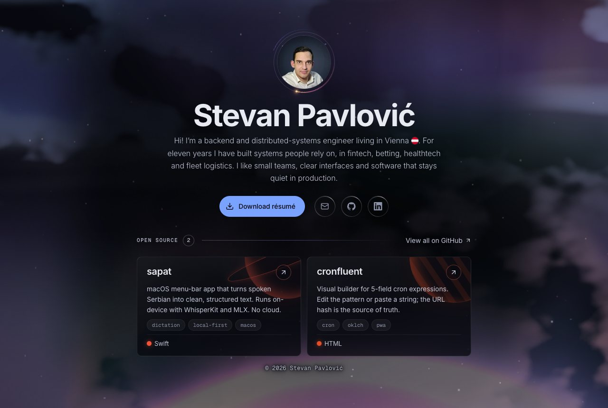
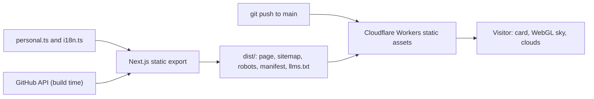
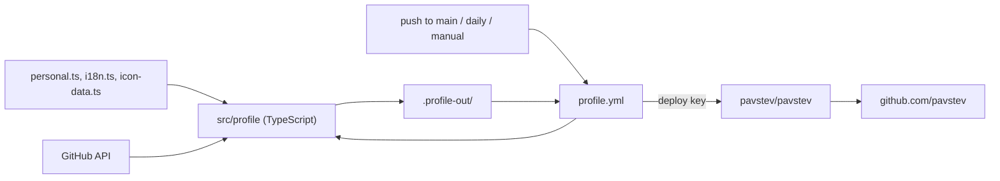

# stevanpavlovic.com

My personal site: one contact card floating over a live WebGL sky.



**Live:** [stevanpavlovic.com](https://stevanpavlovic.com)

## What is in it

- **One static page.** A Next.js 16 App Router export with Tailwind CSS 4. No server, no extra pages. The 404 is plain.
- **A real sky.** A hand-written WebGL nebula with sparkling stars, a rising planet and a shooting star every so often.
- **Real clouds.** One three.js shader with three decks (thin cirrus, far, near), lit from below, with silver edges. They part around the cursor.
- **Small details.** The name tunes in like a signal and glitches while you are around. The portrait turns holographic on hover. Every open-source tile gets its own planet.
- **Found by people and machines.** Metadata, a JSON-LD graph (`WebSite`, `ProfilePage`, `Person`, one `SoftwareSourceCode` per project), a sitemap with images, a manifest, `robots.txt` and `llms.txt`.
- **Careful with your device.** Both animations slow down when idle, pause when hidden and freeze on slow frames.
- **No cookies, no tracking.** A small glass chip at the bottom opens a short note: the site sets no cookies, stores nothing on your device and loads nothing from other companies. Built on the Popover API, with no JavaScript and no consent banner, because there is nothing to consent to.

## How it works

Everything on the page and in the discovery files comes from the same three sources.



### Design notes

- **One frame pacer.** The sky and the clouds share `src/lib/frame-pacer.ts`. It caps the frame rate, drops to 30 fps after 800 ms without input, lowers the render resolution on slow frames and freezes after a run of stalled frames.
- **Software renderers get a still sky.** On SwiftShader, llvmpipe and similar, the sky draws one frame and the clouds never start. Crawlers and lab tools stay fast.
- **Reduced motion is a first-class path.** The intro ends early, the sky and clouds draw one still frame, and pointer effects switch off, also when the setting changes at runtime.
- **The glitch is invisible to screen readers.** The name copies are pseudo-elements with `content: attr(data-text) / ""`, so the name is read once. The glitch rests after 30 seconds without input.
- **The build can fail on purpose.** If the GitHub API answers with anything but 200, the build stops, so a broken project strip never ships.
- **Locked-down headers.** `public/_headers` sets a same-origin CSP, HSTS and immutable caching for hashed assets and fonts. Fonts are self-hosted, subset and not preloaded, because preloading measured slower.

### Checks

`pnpm verify` runs Prettier, ESLint (typescript-eslint, unicorn, Next.js and React hooks rules), the TypeScript compiler, the build and knip. On the built site, Lighthouse gives 100 for SEO, accessibility, best practices and agentic browsing, and axe-core finds 0 violations at desktop, short and phone sizes. Text contrast over the moving sky is measured by hand, because axe cannot read canvas pixels.

## Getting started

You need Node 24 (see `.nvmrc`) and pnpm 12 (Corepack reads it from `package.json`).

```bash
pnpm install
pnpm dev
```

The site runs at <http://localhost:4321>. The repo strip calls the GitHub API at build time. Set the optional `GITHUB_TOKEN` environment variable to lift the 60 requests per hour limit.

| Script               | What it does                                                   |
| -------------------- | -------------------------------------------------------------- |
| `pnpm dev`           | Starts the dev server on port 4321                             |
| `pnpm build`         | Builds the static site into `dist/`                            |
| `pnpm preview`       | Serves `dist/` on port 4321                                    |
| `pnpm verify`        | Formats, lints, type-checks, builds and checks for unused code |
| `pnpm icons`         | Rebuilds `src/lib/icon-data.ts` from the icons used in `src/`  |
| `pnpm profile:build` | Builds the GitHub profile files into `.profile-out/`           |
| `pnpm profile:check` | Runs the profile tests, builds the files and checks them       |

`pnpm verify` also runs as the pre-commit hook (lefthook) and in GitHub Actions. Dependency settings live in `pnpm-workspace.yaml`: an allowlist for build scripts, a one-day minimum release age and a trust policy that blocks package downgrades, with one exact, documented exception.

## Project layout

```text
src/app/          the page, 404, sitemap, robots, manifest, llms.txt
src/components/   one component per file
src/lib/          content, i18n strings, structured data, theme, WebGL and effects
src/styles/       globals.css: tokens, utilities, card styles
public/           résumé, portraits, fonts, icons, share image, headers
src/profile/      generator for the GitHub profile README and its images
scripts/          icon extraction
```

Content lives in `src/lib/personal.ts`. Every UI string lives in `src/lib/i18n.ts`.

## GitHub profile

The README on [github.com/pavstev](https://github.com/pavstev) is not written by hand. This repo builds it. The repo `pavstev/pavstev` only holds a copy that a GitHub Action writes.

The name, title, summary, links and city come from `src/lib/personal.ts` and `src/lib/i18n.ts`. The project list comes from the same GitHub API call as the site (`src/lib/github.ts`). The icons come from `src/lib/icon-data.ts`. The header image is an SVG that the build draws: a sky, your name and your title, with the Inter font inside the file.



### Run it

```bash
pnpm profile:build
pnpm profile:check
```

`pnpm profile:build` writes the files to `.profile-out/`. That folder is not committed. The output is the same every time for the same input: no dates, no random values. `pnpm profile:check` runs the tests, builds the files and fails when something is wrong: a missing image, an image without alt text, an empty section, a link that is not https, or a website or résumé URL that does not answer. CI runs it on every pull request.

### How the sync works

The workflow `.github/workflows/profile.yml` runs on a push to `main` that touches the profile code or data, once a day (the project list can change without a push), and by hand. It builds the files, replaces everything in `pavstev/pavstev` except `.git`, and commits only if something changed. The commit comes from `github-actions[bot]` and names the source commit. Run it by hand with `dry_run` to see the diff and skip the push.

Never edit `pavstev/pavstev` by hand. The next run overwrites it.

### One-time setup

The Action needs a deploy key with write access to `pavstev/pavstev`. Run these commands once:

```bash
ssh-keygen -t ed25519 -N "" -C "profile-sync" -f /tmp/profile_sync
gh repo deploy-key add /tmp/profile_sync.pub -R pavstev/pavstev --allow-write -t "website profile sync"
gh secret set PROFILE_DEPLOY_KEY -R pavstev/website < /tmp/profile_sync
rm /tmp/profile_sync /tmp/profile_sync.pub
```

After this branch is on `main`, test it without a push:

```bash
gh workflow run profile.yml -R pavstev/website -f dry_run=true
```

## Deploy

Every push to `main` makes Cloudflare build the repository and publish `dist/` as Workers static assets (`wrangler.jsonc`). Nobody deploys by hand.

## Contact

Found a bug or want to say hello? Write to [pavlovicmstevan@gmail.com](mailto:pavlovicmstevan@gmail.com).

## License

The code is under the [MIT License](LICENSE). The portraits, the résumé and the personal text are not covered by it: see [NOTICE](NOTICE).
