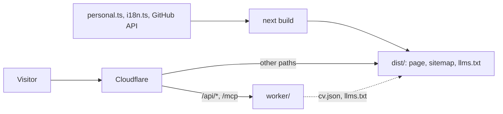

# stevanpavlovic.com

My personal site: one contact card floating over a live WebGL sky, plus a small Worker that answers questions about my CV.


**Live:** [stevanpavlovic.com](https://stevanpavlovic.com)

## What is in it

- **A hand-written sky.** A WebGL nebula with sparkling stars and a shooting star every 15 to 30 s.
- **Real clouds.** One three.js shader: drifting decks lit from below, silver edges, fast cirrus on top. They part around the cursor.
- **A glass bead.** It follows the cursor over the portrait (a finger after a press and hold) and magnifies the photo with chromatic edges, in the card and in the portrait dialog.
- **A name that tunes in.** A CSS signal intro, then every 8 s a WebGL tear and a weight-morph wave across the letters.
- **A planet per project.** Each open-source repo gets its own three.js planet, with language chips in GitHub's colors.
- **Vienna on a globe.** Click "Vienna" in the bio for the coat of arms, a few facts and a three.js globe that loads only then.
- **Kind to your device.** Every loop drops to 30 fps when idle, pauses when hidden, degrades on slow frames and draws one still frame under reduced motion or a software renderer.
- **No cookies.** Cloudflare Web Analytics counts visits without them, and a small chip says so once.

## How it works



The page is a Next.js 16 static export. The Worker in `worker/` runs only for two endpoints:

- `POST /api/ask` streams an AI answer (Workers AI) from the CV, behind Turnstile and a per-IP rate limit.
- `POST /mcp` is a read-only MCP server with five tools: `profile`, `experience`, `skills`, `projects`, `contact`.

Both read `/cv.json` from the static assets, which the upcoming CV feed will publish. Until then `/mcp` answers 502 and `/api/ask` 403 or 502.

## Getting started

Node 24 and pnpm 12. The build reads the GitHub API and needs `GITHUB_TOKEN`; locally it falls back to `gh auth token`.

```bash
pnpm install
pnpm dev   # http://localhost:4321
```

| Script               | What it does                                                                 |
| -------------------- | ---------------------------------------------------------------------------- |
| `pnpm dev`           | Dev server on port 4321                                                      |
| `pnpm build`         | Static site into `dist/`                                                     |
| `pnpm preview`       | Serves `dist/` on port 4321                                                  |
| `pnpm check`         | Format, lint, types (site and Worker), tests, unused code, build, profile    |
| `pnpm fix`           | Applies Prettier and ESLint fixes                                            |
| `pnpm icons`         | Rebuilds `src/lib/icon-data.ts`                                              |
| `pnpm profile:build` | Builds the GitHub profile into `.profile-out/` (`--check` also checks links) |

`pnpm check` changes no file. It runs before every commit (husky) and in CI.

## GitHub profile

The README on [github.com/pavstev](https://github.com/pavstev) is generated here by `src/profile/` from the same data and repo list as the site. `.github/workflows/profile.yml` pushes it to `pavstev/pavstev` on relevant pushes, daily and by hand (`dry_run` shows the diff). Never edit that repo by hand. The workflow needs a deploy key, set up once:

```bash
ssh-keygen -t ed25519 -N "" -C "profile-sync" -f /tmp/profile_sync
gh repo deploy-key add /tmp/profile_sync.pub -R pavstev/pavstev --allow-write -t "website profile sync"
gh secret set PROFILE_DEPLOY_KEY -R pavstev/website < /tmp/profile_sync && rm /tmp/profile_sync*
```

## Deploy

Every push to `main` makes Cloudflare build the repo and publish `dist/` with the Worker (`wrangler.jsonc`). Cloudflare needs `GITHUB_TOKEN` as a build variable and `TURNSTILE_SECRET_KEY` as a Worker secret. Nobody deploys by hand.

## Contact

Found a bug or want to say hello? Write to [hi@stevanpavlovic.com](mailto:hi@stevanpavlovic.com).

## License

The code is under the [MIT License](LICENSE). The portraits, the résumé and the personal text are not covered by it: see [NOTICE](NOTICE).
